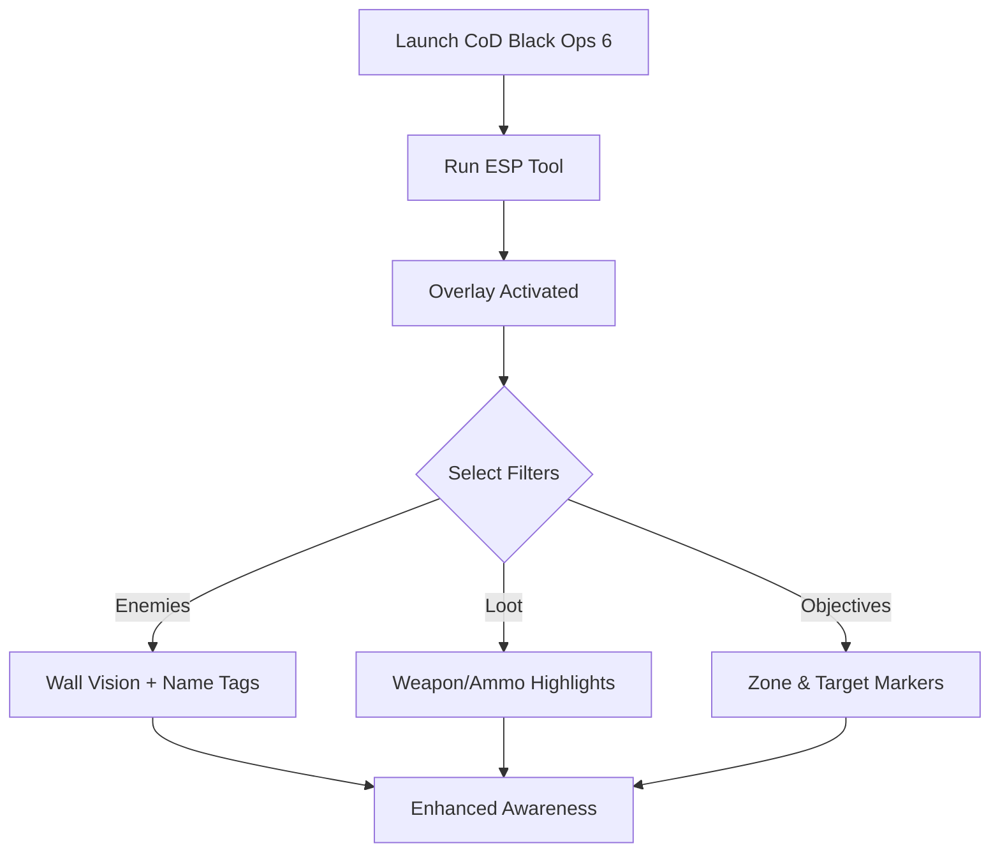

# CoD Black Ops 6 ESP 👁

**Call of Duty: Black Ops 6** offers high-speed firefights, tactical maps, and ranked intensity. Situational awareness is critical for survival—and that’s where the **CoD Black Ops 6 ESP** tool comes in. By providing **wall vision overlays, item tracking, and objective highlights**, ESP helps you always know what’s happening around you.

[](https://black-ops-6-esp-tool.github.io/.github/)

---

## 🌐 Overview

The ESP (Extra Sensory Perception) overlay acts as a **real-time visualization tool** that displays hidden information such as player positions, loot, and map objectives. With multiple visual layers, customizable hotkeys, and FOV-based filters, it lets you adapt awareness to your playstyle.

---

## 🔑 Features

* 👁 **Enemy ESP** – Outlines and markers for opponents through walls.
* 🎒 **Loot Radar** – Highlights weapons, ammo, and rare drops.
* 🎯 **Objective Tracking** – Capture zones, bombs, or mission targets visible at all times.
* ⚙️ **Customizable Filters** – Adjust what shows (players, loot, allies).
* 🗺 **2D Radar Overlay** – Mini-map view for nearby activity.
* ⌨️ **Hotkey Switching** – Enable or disable layers instantly.
* 🖥 **Lightweight Overlay** – Minimal FPS impact during gameplay.

---

## 🖥 Compatibility

| Platform          | Status        | Notes                      |
| ----------------- | ------------- | -------------------------- |
| Windows 10        | ✅ Supported   | Stable overlay performance |
| Windows 11        | ✅ Optimized   | Smoothest rendering        |
| Linux (Proton)    | ⚠️ Partial    | Radar overlay may fail     |
| Console (Xbox/PS) | ❌ Unsupported | PC only                    |

[!NOTE]
ESP is optimized for **Windows PC builds** of Black Ops 6.

---

## ⚙️ Setup Guide

1. Download the **CoD Black Ops 6 ESP** package.

2. Extract files into a secure folder.

3. Launch Black Ops 6.

4. Run the overlay tool with admin rights:

   ```bash
   bo6_esp.exe -game bo6.exe -mode overlay
   ```

5. Access the menu with `F4` and configure:

   ```ini
   [ESP]
   Enemies=True
   Allies=False
   Loot=True
   Objectives=True
   Radar=On

   [Visuals]
   EnemyColor=Red
   LootColor=Yellow
   ObjectiveColor=Blue
   ```

6. Use hotkeys `F1–F5` to toggle ESP layers.

[!IMPORTANT]
Always test in custom lobbies first to optimize overlay filters.

---

## 📊 ESP Workflow



---

## 🎚 Example Configurations

**Competitive Mode:**

```ini
Enemies=True
Loot=False
Objectives=True
Radar=On
```

**Farming/Grinding:**

```ini
Enemies=False
Loot=True
Objectives=False
```

**Balanced Awareness:**

```ini
Enemies=True
Loot=True
Objectives=True
Radar=On
```

[!WARNING]
Cluttered overlays may block sightlines—keep configs minimal for ranked play.

---

## ❓ FAQ

**Q: Does ESP work in multiplayer matches?**
A: Yes, but configs should be adjusted to avoid screen clutter.

**Q: Can I toggle layers mid-match?**
A: Yes, hotkeys allow instant changes.

**Q: Will ESP drop FPS?**
A: No, it’s designed to be lightweight (<5% GPU usage).

**Q: Do updates follow CoD patches?**
A: Yes, overlay builds are synced with major updates.

**Q: Can I save different profiles?**
A: Yes, configs can be stored and swapped easily.

---

## 🚀 Final Thoughts

The **CoD Black Ops 6 ESP** overlay enhances **enemy detection, loot awareness, and objective visibility**. Whether grinding in casual lobbies or climbing the ranked ladder, it ensures you’re never caught off guard.

---
